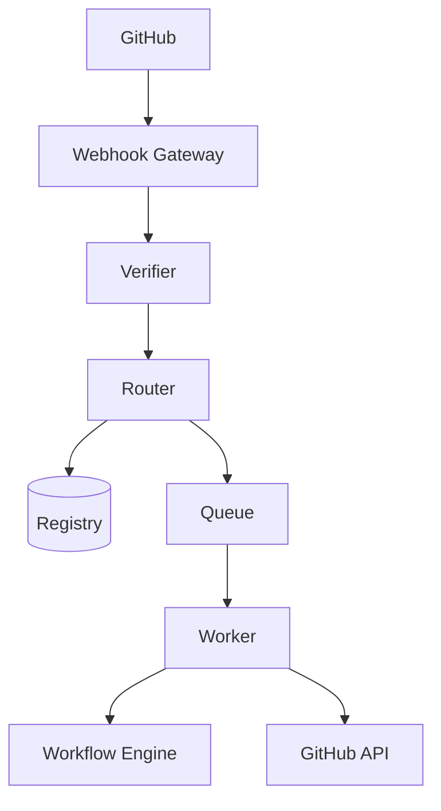
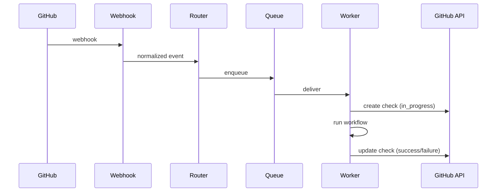

# ADR 0001: Multi-Tenant GitHub App with Status Reporting

## Status
Proposed

## Context

We are building a platform that integrates with GitHub via a GitHub App to:

- receive repository events (push, pull request)
- launch tenant-scoped workflows (e.g., Argo)
- enforce policies and validations
- report results back to commits and pull requests

The system must support:

- multi-tenancy
- multiple GitHub installations
- strong isolation
- async processing
- native GitHub developer feedback

---

## Use Cases

### Pull Request Validation
- PR opened/updated
- Workflow triggered
- Check run posted:
  - in_progress → success/failure

### Push Deployment
- Push to main
- Deployment workflow runs
- Status visible on commit

### Repo Onboarding
- Repo registered
- Validation workflow runs
- Check confirms readiness

### Policy Enforcement
- PR violates policy
- Check fails
- Merge blocked

### Multi-Tenant Isolation
- Events resolved via:
  (installation_id, repository_id)
- Execution isolated per tenant

---

## Decision

### Single Multi-Tenant GitHub App
- One app, many tenants
- Internal mapping:
  (installation_id, repository_id) → tenant

### Status Reporting First-Class
- Use Checks API (default)
- Optional commit status fallback

Lifecycle:
1. create check (in_progress)
2. run workflow
3. update check (success/failure)

### Async Processing
- webhook → queue → worker

### Tenant Isolation
- namespace per tenant/repo
- scoped tokens
- no cross-tenant access

### Dedicated Reporter
- component handles GitHub updates
- retries + idempotency

---

## Consequences

### Positive
- Native GitHub UX
- Scalable
- Strong isolation
- Works with branch protection

### Negative
- More complexity
- Must track checkRunIds
- Token lifecycle management
- Rate limits

---

## Architecture

---

## Sequence

---

## Status Lifecycle

This table maps internal states to GitHub Check run status and the commit-status fallback state.

| Internal | Check run status | Commit status state |
|--------|------------------|---------------------|
| accepted | in_progress | pending |
| success  | completed   | success |
| failure  | completed   | failure |

---

## Key Principles

- installation ≠ tenant
- numeric repo IDs
- idempotent processing
- async execution
- GitHub is both input + output surface
