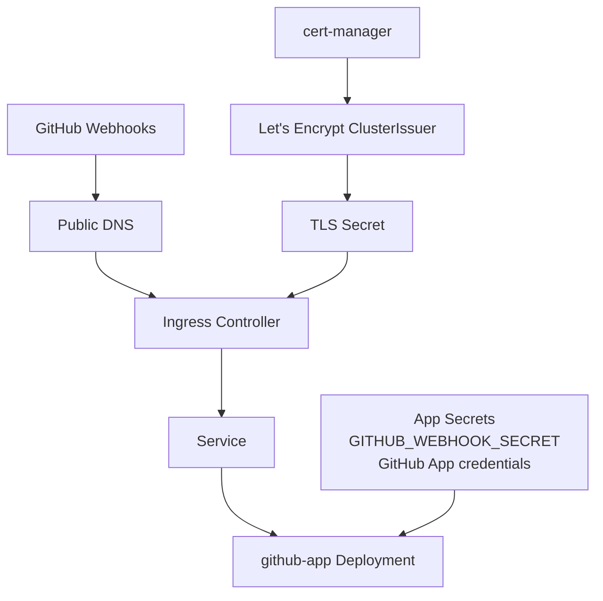

# ADR 0003: Deploy the GitHub App with Kind, Helm, and Let’s Encrypt

## Status
Proposed

## Date
2026-04-01

## Context

[ADR 0001](0001-multi-tenant-github-app.md) defines the target system architecture for a multi-tenant
GitHub App with webhook intake, async processing, and GitHub status reporting.
[ADR 0002](0002-multi-tenant-implementation.md) documents the current implementation structure in Go.

We now need a deployment approach for this solution that is:

- simple enough for local and early-stage platform use
- close enough to production Kubernetes patterns to avoid throwaway deployment work
- compatible with the app’s current HTTP interface:
  - `POST /webhook`
  - `GET /healthz`
- able to terminate TLS for GitHub webhook delivery
- able to manage application secrets without committing them to source control

The current application is packaged as a single Go binary and expects runtime configuration through
environment variables such as:

- `PORT`
- `GITHUB_WEBHOOK_SECRET`

The broader production deployment will also require GitHub App credentials and additional runtime
configuration as the implementation evolves.

We want to standardize on:

- **Kind** for the reference local Kubernetes cluster
- **Helm** for packaging and environment-specific configuration
- **Let’s Encrypt** certificate issuance, with Kubernetes TLS secrets created and rotated automatically

### Deployment constraints

This app receives inbound webhooks from GitHub. That means the webhook endpoint must be:

- reachable from GitHub over the public internet
- served over HTTPS with a certificate trusted by GitHub
- stable enough to support webhook configuration and retries

A plain local Kind cluster running only on `localhost` is **not by itself sufficient** for GitHub webhook
integration. It must be paired with either:

- a publicly routable ingress endpoint and DNS record, or
- a secure tunnel / reverse proxy that exposes the cluster ingress externally

Additionally, Let’s Encrypt HTTP-01 validation requires a publicly reachable hostname. For purely local,
offline development, a self-signed or local CA issuer may still be needed.

---

## Decision

### 1. Use Helm as the deployment contract

The GitHub App will be deployed as a **Helm chart**.

The chart will be the canonical packaging format for Kubernetes deployment and will manage:

- `Deployment`
- `Service`
- `Ingress`
- environment variable injection from `Secret` / `ConfigMap`
- health probes for `/healthz`
- ingress annotations for cert-manager

Environment-specific differences (local, shared dev, staging, production) will be expressed through
Helm values files rather than separate manifests.

### 2. Use Kind as the reference local Kubernetes environment

A **Kind** cluster will be the default local Kubernetes target for development and platform iteration.

Kind is chosen because it:

- is easy to create and destroy
- works well on developer machines and CI
- closely matches core Kubernetes APIs used by the application
- is sufficient for testing the Helm chart, service wiring, probes, ingress resources, and secret mounting

Kind is treated as the **reference local cluster**, not as the final production hosting platform.

### 3. Use an ingress controller in front of the app

The application will be exposed through a Kubernetes `Ingress` backed by an ingress controller
(such as ingress-nginx).

Ingress responsibilities:

- route external HTTPS traffic to the app `Service`
- expose `/webhook` and `/healthz`
- integrate with cert-manager for certificate issuance
- provide a stable host name for GitHub webhook configuration

### 4. Use cert-manager with Let’s Encrypt for TLS

TLS certificates will be issued by **cert-manager** using a **Let’s Encrypt ClusterIssuer**.

The chart will reference an ingress TLS secret name, but the TLS certificate material itself will
be created and rotated by cert-manager.

This means:

- certificate private keys and cert chains are stored as Kubernetes `Secret` resources
- certificates are renewed automatically
- the Helm chart does **not** embed PEM material in values files
- TLS for GitHub webhooks is managed declaratively through Kubernetes resources

The preferred initial validation flow is **HTTP-01** via the ingress controller.

### 5. Store application secrets as Kubernetes Secrets referenced by Helm values

Application secrets (for example `GITHUB_WEBHOOK_SECRET`, and later GitHub App private key material)
will be stored as Kubernetes `Secret` resources and mounted or injected into the pod.

The Helm chart will support secret references rather than requiring raw secret values committed in Git.

This decision applies to:

- GitHub webhook secret
- GitHub App credentials
- future API tokens or database credentials

Let’s Encrypt-generated TLS secrets are treated separately from application secrets, but both live in the
cluster as Kubernetes Secrets.

### 6. Support two certificate modes

Because Kind alone is not publicly reachable, we will explicitly support two operational modes:

#### Mode A: Publicly reachable dev/staging
Use:
- Kind or another Kubernetes cluster
- ingress controller
- public DNS record
- cert-manager + Let’s Encrypt

This mode supports real GitHub webhook delivery and real HTTPS certificates.

#### Mode B: Local-only development
Use:
- Kind
- ingress controller
- self-signed/local CA issuer or plain local HTTP during isolated testing
- optional tunnel if external webhook testing is needed

This mode is used for chart validation and local development when a public hostname is unavailable.

---

## Architecture

### Resource model

The initial Helm chart should manage or expect the following resources:

- `Deployment` for the app
- `Service` exposing the app on port 80/8080 internally
- `Ingress` for HTTPS routing
- `Secret` for application configuration
- `Certificate` and/or ingress annotations consumed by cert-manager
- `ClusterIssuer` installed separately or by platform bootstrap

### Runtime flow

1. GitHub sends webhook traffic to the configured HTTPS host.
2. DNS resolves to the ingress endpoint.
3. The ingress controller terminates TLS using a cert-manager-managed secret.
4. The request is routed to the app `Service`.
5. The app receives the request on `/webhook`.
6. Kubernetes uses `/healthz` for probes and monitoring.

---

## Consequences

### Positive

- Helm provides a repeatable deployment contract across environments.
- Kind gives a low-friction local Kubernetes target for development and CI.
- cert-manager + Let’s Encrypt removes manual certificate creation and renewal.
- TLS is handled in-cluster using standard Kubernetes patterns.
- Secrets are not stored directly in deployment manifests.
- The deployment model is portable to other Kubernetes providers later.

### Negative

- A local Kind cluster is not enough for real GitHub webhook delivery unless paired with public reachability.
- Let’s Encrypt cannot issue certificates for a purely local, non-public hostname.
- Additional components are required before the app is deployable:
  - ingress controller
  - cert-manager
  - issuer configuration
- Operational complexity increases compared to running the binary directly.
- Secret lifecycle is only partially solved; long-term secret sync/encryption may still require an external system.

---

## Deployment-specific considerations

### Helm chart scope

The chart should include values for at least:

- image repository and tag
- replica count
- service port / container port
- ingress enablement
- ingress class name
- hostname
- TLS secret name
- cert-manager issuer name
- environment variables from secret refs
- resource requests / limits
- probe configuration for `/healthz`

### Bootstrap order

The recommended bootstrap sequence is:

1. Create Kind cluster
2. Install ingress controller
3. Install cert-manager
4. Create `ClusterIssuer` for Let’s Encrypt
5. Create application secrets
6. Install/upgrade the Helm chart
7. Configure GitHub webhook URL to the ingress hostname

### Secret handling

Do not commit raw secrets, private keys, or certificate material to Git.

The preferred initial pattern is:

- create secrets out-of-band (`kubectl create secret`, sealed process, or CI secret injection)
- reference them from Helm values
- let cert-manager create and rotate TLS secrets automatically

### Webhook reachability

For real GitHub integration testing, the deployment must provide:

- a public hostname
- valid HTTPS
- routable ingress traffic to the cluster

Possible approaches include:

- running the cluster on a publicly reachable VM
- exposing ingress through a load balancer
- using a tunnel that forwards a public hostname to the cluster ingress

### Production parity

Kind is intentionally a local reference environment. The Helm chart should avoid Kind-specific assumptions
so it can be reused later on managed Kubernetes.

That means avoiding assumptions about:

- storage classes
- load balancer implementation details
- node topology
- hostPath-dependent behavior

---

## Alternatives considered

### 1. Raw Kubernetes manifests

Rejected because:

- they are harder to parameterize per environment
- secret and ingress configuration becomes repetitive
- upgrades and overrides are less ergonomic than Helm values

### 2. Docker Compose only

Rejected because:

- it does not model the target Kubernetes deployment shape
- ingress and certificate management differ substantially
- it would create a second deployment path with low reuse

### 3. Manual certificate management

Rejected because:

- certificate renewal becomes operational toil
- private key handling becomes more error-prone
- cert-manager with Let’s Encrypt is a better Kubernetes-native pattern

---

## Follow-up work

1. Create a Helm chart for `github-app`
2. Add chart values for ingress host, TLS secret name, and secret references
3. Add Kubernetes probes mapped to `/healthz`
4. Add bootstrap docs for Kind + ingress-nginx + cert-manager
5. Define a `ClusterIssuer` manifest for Let’s Encrypt staging and production
6. Define how GitHub App credentials are stored and referenced in Kubernetes
7. Add a local-development fallback issuer strategy for non-public environments
8. Add deployment documentation for exposing the webhook endpoint to GitHub
9. Add targets to makefile for deploying to Kind and validating the Helm chart as well as cleaning up resources
