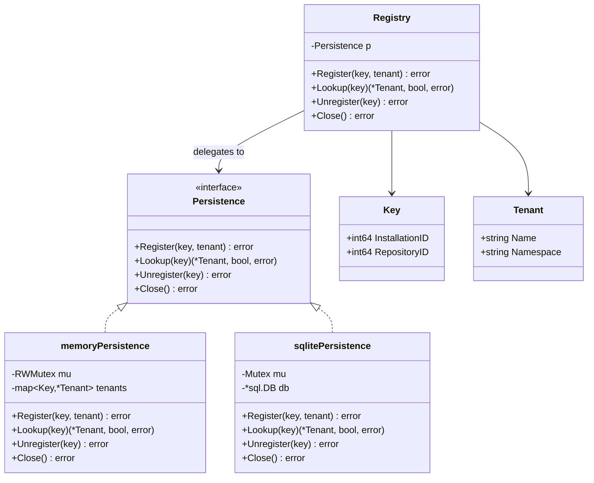
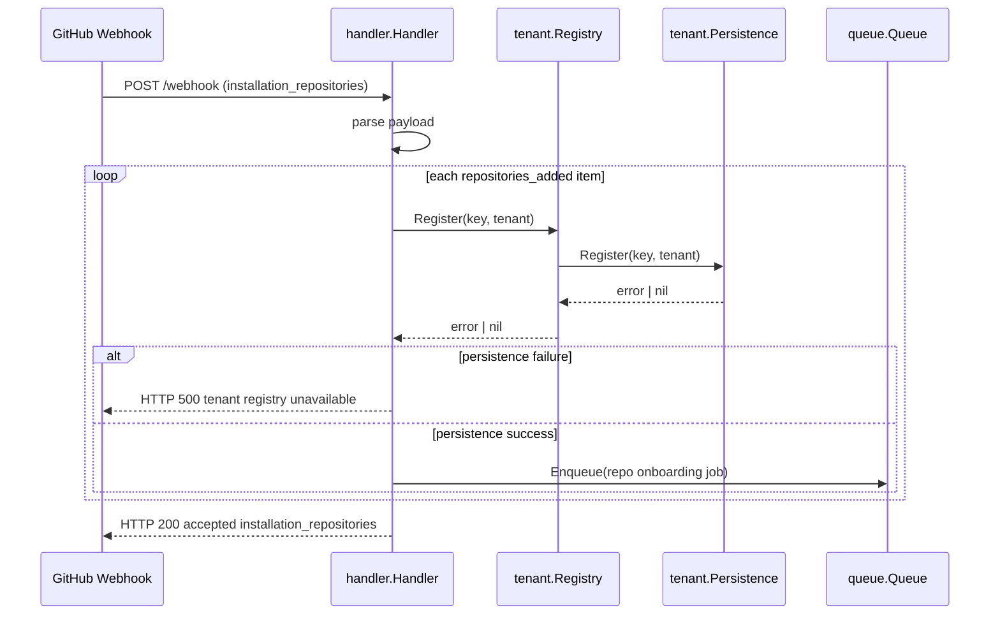
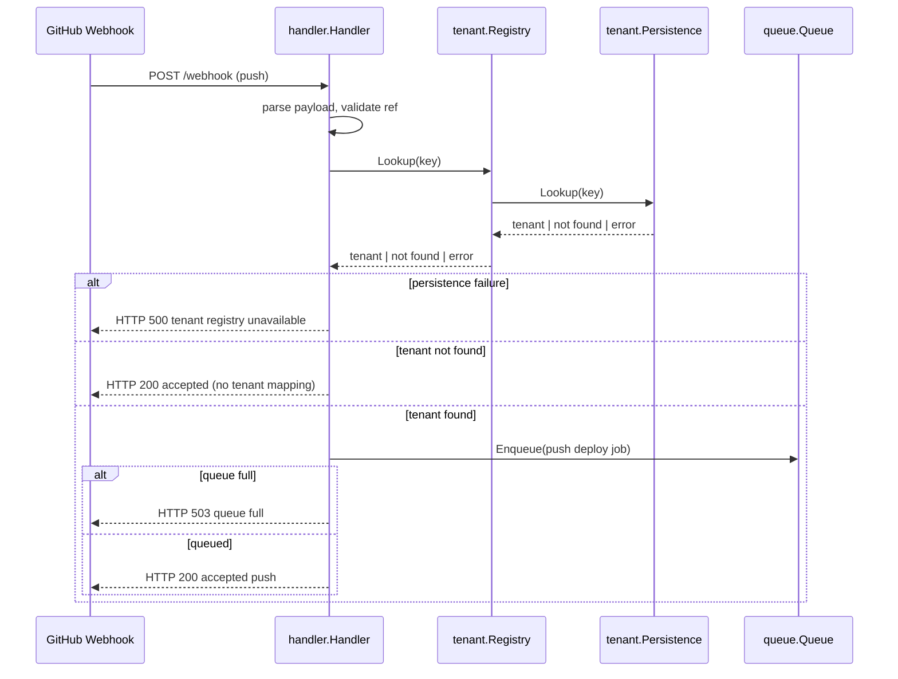

# Tenant Persistence Layer

This document describes the pluggable tenant persistence layer used by the GitHub App.

## Overview

Tenant mappings are keyed by `(installation_id, repository_id)` and map to tenant metadata (`name`, `namespace`).

The `tenant.Registry` delegates persistence behavior to a `tenant.Persistence` interface, allowing the app to switch between in-memory and SQLite-backed storage via environment configuration.

SQLite persistence uses an embedded Go SQLite driver through `database/sql` (no external `sqlite3` binary dependency).

---

## Class diagram



---

## Sequence diagram

### Installation onboarding (`installation_repositories` action=`added`)



### Push deploy (`push` on `refs/heads/main`)



---

## Data structure

### API-level entities

| Type | Fields | Notes |
|------|--------|-------|
| `tenant.Key` | `InstallationID int64`, `RepositoryID int64` | Composite identifier for a tenant mapping. |
| `tenant.Tenant` | `Name string`, `Namespace string` | Tenant metadata used by worker jobs. |

### SQLite schema

Table: `tenants`

| Column | Type | Constraints |
|--------|------|-------------|
| `installation_id` | `INTEGER` | `NOT NULL`, part of primary key |
| `repository_id` | `INTEGER` | `NOT NULL`, part of primary key |
| `name` | `TEXT` | `NOT NULL` |
| `namespace` | `TEXT` | `NOT NULL` |

Primary key: `(installation_id, repository_id)`.

Storage semantics:
- `Register` performs upsert semantics (insert or replace existing row for same primary key).
- `Lookup` returns exactly one row by primary key, if present.
- `Unregister` deletes by primary key.

---

## Operator instructions

### Select persistence backend

Use environment variables to choose backend at startup:

- `TENANT_PERSISTENCE=memory` (default)
- `TENANT_PERSISTENCE=sqlite`
- `TENANT_SQLITE_DSN=/path/to/tenants.db` (optional for sqlite; defaults to `tenants.db` in process working directory)

Example:

```bash
export GITHUB_WEBHOOK_SECRET=replace-me
export TENANT_PERSISTENCE=sqlite
export TENANT_SQLITE_DSN=/var/lib/github-app/tenants.db
./bin/github-app
```

### Recommended operational practices for SQLite

1. **Use persistent storage** for the DSN path (bind mount or durable volume) so tenant mappings survive restarts.
2. **Set file permissions** so only the service user can read/write the DB file.
3. **Backup strategy**: include the SQLite DB file in regular backups if tenant registrations are considered durable operational state.
4. **Health checks**: webhook `500 tenant registry unavailable` responses can indicate persistence failures; monitor logs and HTTP response codes.
5. **Rollback/fallback**: if SQLite storage becomes unavailable, switching `TENANT_PERSISTENCE=memory` restores service behavior but loses durable mappings.

### Validation commands

```bash
make test-tenant
make test-tenant-sqlite
go test ./...
```
