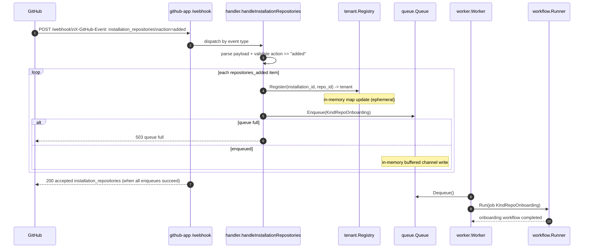
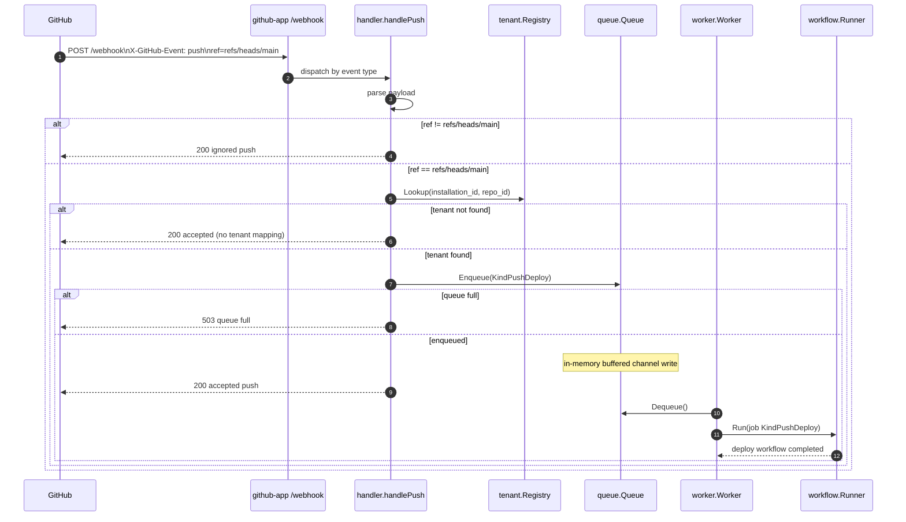

# GitHub Integration Flows

This document covers the two primary integration flows **to and from GitHub** in this service:

1. Repository registration (`installation_repositories` with `action=added`)
2. Push to `main` (`push` with `ref=refs/heads/main`)

## State model in `github-app`

`github-app` maintains **ephemeral, in-process state** only.

| State | Purpose | In-memory location | Created/updated by | Removed/expired | Persistence |
|---|---|---|---|---|---|
| Tenant mapping (`installation_id`, `repository_id`) → tenant metadata | Resolve runtime tenant context for later events | `tenant.Registry.tenants` map | `handleInstallationRepositories` via `(*Registry).Register` | Process restart, or explicit `(*Registry).Unregister` | Not persisted to disk/database |
| Pending async jobs | Buffer webhook-derived work for worker processing | `queue.Queue.ch` buffered channel | `handleInstallationRepositories` / `handlePush` via `(*Queue).Enqueue` | Dequeued by worker or lost on process restart | Not persisted to disk/database |
| In-flight workflow/check lifecycle | Tracks active work in goroutines | Worker goroutines + local variables | `(*Worker).Start` / `(*Worker).process` | Ends when job completes/cancels | Not persisted to disk/database |

Reference implementation points:

- Registry: `internal/tenant/tenant.go`
- Queue: `internal/queue/queue.go`
- Webhook handlers: `internal/handler/handler.go`
- Worker execution: `internal/worker/worker.go`
- App wiring: `cmd/github-app/main.go`

## Data-at-rest model

Within this repository's current runtime path, there is **no application-managed durable store** (no DB/filesystem writes) for webhook payloads, tenant mappings, or jobs.

### Where data is at rest (and not at rest)

1. **Inside `github-app` process:**
   - Data exists in memory only (maps/channels/stack variables).
   - Data is lost on restart.
2. **On GitHub (external system):**
   - Webhook event records and check run objects are persisted by GitHub according to GitHub's platform behavior/policies.
3. **Operational logs:**
   - The app emits logs to stdout/stderr; durable retention depends on deployment log sinks (container runtime, cluster logging, etc.), which are outside this repo's code path.

---

## 1) Registration flow

In this codebase, registration is modeled as GitHub sending an `installation_repositories` webhook event with `action=added` after repositories are added to an app installation.

### Sequence diagram

### Data at rest in this flow (when / where / how)

- **When:** during registration handling and worker processing.
- **Where:** in-process memory (`tenant.Registry` map and `queue.Queue` channel).
- **How:** via map assignment in `Register` and channel send in `Enqueue`.
- **Durability:** none in app process; state is volatile and cleared on restart.

### GitHub documentation

- Webhook events and payloads (overview): <https://docs.github.com/en/webhooks/webhook-events-and-payloads>
- `installation_repositories` event: <https://docs.github.com/en/webhooks/webhook-events-and-payloads#installation_repositories>
- About GitHub Apps webhooks: <https://docs.github.com/en/apps/creating-github-apps/registering-a-github-app/about-webhooks-for-github-apps>

### Path to method in `github-app`

- Webhook entrypoint and event dispatch: `internal/handler/handler.go` → `HandleWebhook`
- Registration logic: `internal/handler/handler.go` → `handleInstallationRepositories`
- Tenant mapping write: `internal/tenant/tenant.go` → `(*Registry).Register`
- Async onboarding queue write: `internal/queue/queue.go` → `(*Queue).Enqueue`
- Background processing: `internal/worker/worker.go` → `(*Worker).Start`
- Workflow execution interface: `internal/workflow/runner.go` → `workflow.Runner.Run`
- Current stub implementation: `internal/workflow/runner.go` → `(*StubRunner).Run`

---

## 2) Push to branch (`main`) flow

GitHub sends a `push` webhook; this app only deploy-processes pushes where `ref == refs/heads/main`.

### Sequence diagram

### Data at rest in this flow (when / where / how)

- **When:** only for accepted `refs/heads/main` push events whose queue write succeeds.
- **Where:** in-process memory (job in queue channel, transient worker variables).
- **How:** normalized webhook payload fields are copied into a `queue.Job` and sent to channel.
- **Durability:** none in app process; queued/in-flight jobs are lost on restart.

### GitHub documentation

- `push` event: <https://docs.github.com/en/webhooks/webhook-events-and-payloads#push>
- Webhook delivery headers (includes `X-GitHub-Event`): <https://docs.github.com/en/webhooks/using-webhooks/handling-webhook-deliveries>
- Webhook events and payloads (overview): <https://docs.github.com/en/webhooks/webhook-events-and-payloads>

### Path to method in `github-app`

- Webhook entrypoint and event dispatch: `internal/handler/handler.go` → `HandleWebhook`
- Push handling and `main` branch gate (`deployRef`): `internal/handler/handler.go` → `handlePush`
- Tenant lookup: `internal/tenant/tenant.go` → `(*Registry).Lookup`
- Async deploy queue write: `internal/queue/queue.go` → `(*Queue).Enqueue`
- Background processing: `internal/worker/worker.go` → `(*Worker).Start`
- Workflow execution interface: `internal/workflow/runner.go` → `workflow.Runner.Run`
- Current stub implementation: `internal/workflow/runner.go` → `(*StubRunner).Run`
